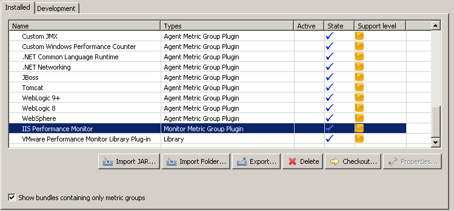
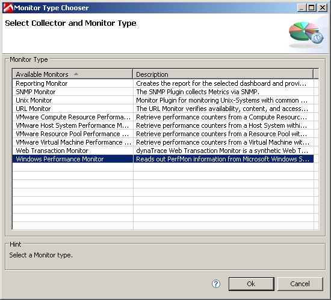
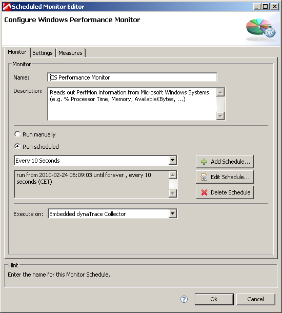
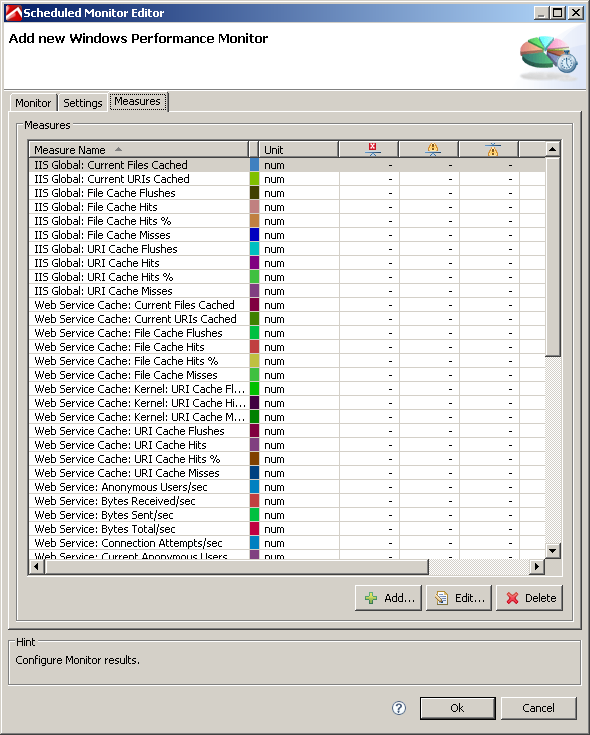
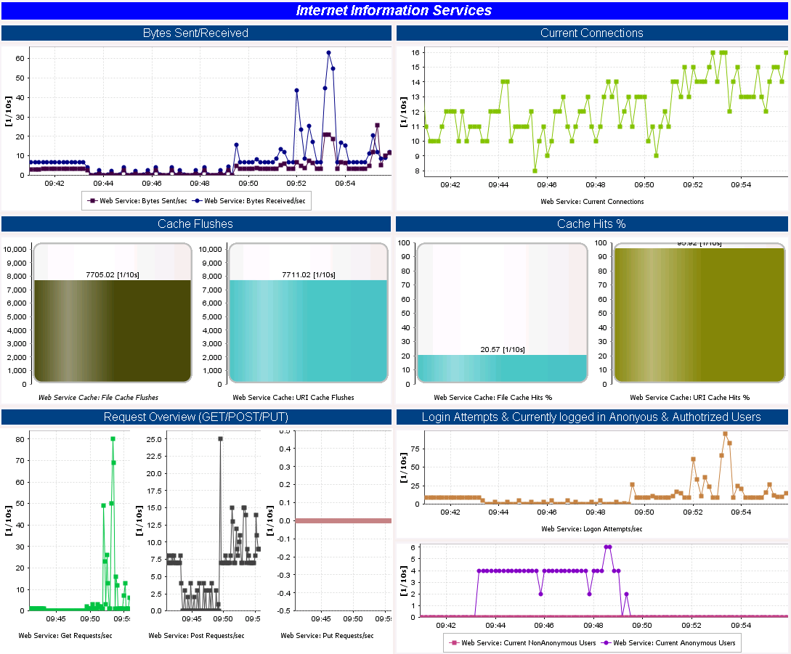

<html xmlns="http://www.w3.org/1999/xhtml">
<head>
    <title>IIS Monitoring Plugin</title>
    <meta http-equiv="Content-Type" content="text/html; charset=UTF-8"/>
    <meta http-equiv="X-UA-Compatible" content="IE=EmulateIE8" />
    <meta content="Scroll Wiki Publisher" name="generator"/>
    <link type="text/css" rel="stylesheet" href="css/blueprint/liquid.css" media="screen, projection"/>
    <link type="text/css" rel="stylesheet" href="css/blueprint/print.css" media="print"/>
    <link type="text/css" rel="stylesheet" href="css/content-style.css" media="screen, projection, print"/>
    <link type="text/css" rel="stylesheet" href="css/screen.css" media="screen, projection"/>
    <link type="text/css" rel="stylesheet" href="css/print.css" media="print"/>
</head>
<body>
                <h1>IIS Monitoring Plugin</h1>
    

        <table>
<thead class=" "></thead><tfoot class=" "></tfoot><tbody class=" ">    <tr>
            <td rowspan="1" colspan="1">
        

Name    

            </td>
                <td rowspan="1" colspan="1">
        

IIS (Internet Information Services) Monitoring Plugin for dynaTrace 3.2+, 4.x    

            </td>
        </tr>
    <tr>
            <td rowspan="1" colspan="1">
        

Description    

            </td>
                <td rowspan="1" colspan="1">
        

The IIS Monitoring Plugin extends the Windows Performance Counter Monitor with <strong class=" ">pre-configured measures for Internet Information Services</strong>    

            </td>
        </tr>
    <tr>
            <td rowspan="1" colspan="1">
        

Plug-In Version    

            </td>
                <td rowspan="1" colspan="1">
        

3.2    

            </td>
        </tr>
    <tr>
            <td rowspan="1" colspan="1">
        

Compatible with    

            </td>
                <td rowspan="1" colspan="1">
        

dynaTrace Diagnostics 3.2+, 4.x    

            </td>
        </tr>
    <tr>
            <td rowspan="1" colspan="1">
        

Tested with:    

            </td>
                <td rowspan="1" colspan="1">
        

IIS 6 &amp; 7    

            </td>
        </tr>
    <tr>
            <td rowspan="1" colspan="1">
        

Author    

            </td>
                <td rowspan="1" colspan="1">
        

Andreas Grabner (andreas.grabner@dynatrace.com)    

            </td>
        </tr>
    <tr>
            <td rowspan="1" colspan="1">
        

Download    

            </td>
                <td rowspan="1" colspan="1">
        

<a href="attachments_23725272_1_dynaTrace_PerfMonIIS_v3.2.zip">IIS Monitoring Plugin</a>    

            </td>
        </tr>
    <tr>
            <td rowspan="1" colspan="1">
        

License    

            </td>
                <td rowspan="1" colspan="1">
        

<a href="attachments_5275722_2_dynaTraceBSD.txt">dynaTrace BSD</a>    

            </td>
        </tr>
    <tr>
            <td rowspan="1" colspan="1">
        

Support    

            </td>
                <td rowspan="1" colspan="1">
        

<a href="https://community/display/DL/Support+Levels#SupportLevels-Community">Not Supported </a>    

            </td>
        </tr>
    <tr>
            <td rowspan="1" colspan="1">
        

Screenshots    

            </td>
                <td rowspan="1" colspan="1">
        

<strong class=" ">Verify Installed Plugin in Server Preferences-&gt;Plugins</strong>             
          <strong class=" ">Create a new Windows Performance Monitor for your System Profile</strong>             
          <strong class=" ">Give it the name IIS Performance Monitor (name is important if you want to use the attached dashboard)</strong>             
          <strong class=" ">List of subscribed IIS specific performance counters</strong>             
          <strong class=" ">The package also includes the following dashboard.</strong>             
            

            </td>
        </tr>
    <tr>
            <td rowspan="1" colspan="1">
        

Install Description    

            </td>
                <td rowspan="1" colspan="1">
        

1) Extract the attached zip file to your file system 2) Open the Server Preferences dialog and open the Plugins tab 4) Choose &quot;Import JAR ...&quot; and select the extracted file &quot;com.dynatrace.diagnostics.plugin.PerfMonIIS_3.2.0.0.jar&quot; 5) Verify that the plugin was correctly installed. Verify that the plugin &quot;IIS Performance Monitor&quot; shows up in the list of installed plugins  In order to subscribe to IIS Performance Measures you have to: 1) Edit your System Profile 2) Add a new Monitor 3) Select &quot;Windows Performance Monitor&quot; 4) Specify &quot;IIS Performance Monitor&quot; as the monitors name (This is important if you also want to use the IIS Monitoring Dashboard that is attached to this plugin) 5) Specify the hostname of IIS in the monitor properties 6) View a list of all Measures that you now have subscribed. You can view and modify the list on the Measures tab  <strong class=" ">IIS Dashboard</strong> 1) Open the Dashboard (Internet Information Services.dashboard.xml) that is part of the download package. 2) You will be prompted to specify the data source as the original datasource is not accessible. Select the System Profile that contains the Monitor with the name &quot;IIS Performance Monitor&quot; 3) The dashboard is configured to refresh every 10 seconds    

            </td>
        </tr>
    <tr>
            <td rowspan="1" colspan="1">
        

Compatibility Matrix    

            </td>
                <td rowspan="1" colspan="1">
        

    

            </td>
        </tr>
    <tr>
            <td rowspan="1" colspan="1">
        

Disclaimer    

            </td>
                <td rowspan="1" colspan="1">
        

    

            </td>
        </tr>
</tbody>        </table>
            

    

    

    

        <table>
<thead class=" ">    <tr>
            <td rowspan="1" colspan="1">
        

&nbsp;    

            </td>
                <td rowspan="1" colspan="1">
        

<a href="IIS_Monitoring_Plugin.html">File</a>    

            </td>
                <td rowspan="1" colspan="1">
        

<a href="IIS_Monitoring_Plugin.html">Modified</a>    

            </td>
        </tr>
</thead><tfoot class=" "></tfoot><tbody class=" ">    <tr>
            <td rowspan="1" colspan="1">
                </td>
                <td rowspan="1" colspan="1">
        

PNG File                    <a href="https://community/download/attachments/23594447/create_monitor_2%5B1%5D.PNG?api=v2">create_monitor_2[1].PNG</a>    

            </td>
                <td rowspan="1" colspan="1">
        

Aug 30, 2014by<a href="    /community/display/~marcia.beierle@compuware.com ">Beierle Marcia</a>    

            </td>
        </tr>
    <tr>
            <td rowspan="1" colspan="1">
                </td>
                <td rowspan="1" colspan="2">
        

            
            

    

Labels    

<ul class="label-list has-pen "><li class="no-labels-message ">    

No labels    

</li><li class="labels-edit-container ">    

<a href="IIS_Monitoring_Plugin.html">Edit Labels</a>    

</li></ul>    

    

            </td>
        </tr>
    <tr>
            <td rowspan="1" colspan="1">
                </td>
                <td rowspan="1" colspan="1">
        

PNG File                    <a href="https://community/download/attachments/23594447/icon.png?api=v2">icon.png</a>    

            </td>
                <td rowspan="1" colspan="1">
        

Apr 02, 2012by<a href="    /community/display/~wolfgang.gottesheim@compuware.com ">Wolfgang Gottesheim</a>    

            </td>
        </tr>
    <tr>
            <td rowspan="1" colspan="1">
                </td>
                <td rowspan="1" colspan="2">
        

            
            

    

Labels    

<ul class="label-list has-pen "><li class="no-labels-message ">    

No labels    

</li><li class="labels-edit-container ">    

<a href="IIS_Monitoring_Plugin.html">Edit Labels</a>    

</li></ul>    

    

            </td>
        </tr>
    <tr>
            <td rowspan="1" colspan="1">
                </td>
                <td rowspan="1" colspan="1">
        

File                    <a href="https://community/download/attachments/23594447/import_monitor.PNG?api=v2">import_monitor.PNG</a>    

            </td>
                <td rowspan="1" colspan="1">
        

Mar 08, 2010by<a href="    /community/display/~andreas.grabner@compuware.com ">Andreas Grabner</a>    

            </td>
        </tr>
    <tr>
            <td rowspan="1" colspan="1">
                </td>
                <td rowspan="1" colspan="2">
        

            
            

    

Labels    

<ul class="label-list has-pen "><li class="no-labels-message ">    

No labels    

</li><li class="labels-edit-container ">    

<a href="IIS_Monitoring_Plugin.html">Edit Labels</a>    

</li></ul>    

    

            </td>
        </tr>
    <tr>
            <td rowspan="1" colspan="1">
                </td>
                <td rowspan="1" colspan="1">
        

File                    <a href="https://community/download/attachments/23594447/create_monitor.PNG?api=v2">create_monitor.PNG</a>    

            </td>
                <td rowspan="1" colspan="1">
        

Mar 08, 2010by<a href="    /community/display/~andreas.grabner@compuware.com ">Andreas Grabner</a>    

            </td>
        </tr>
    <tr>
            <td rowspan="1" colspan="1">
                </td>
                <td rowspan="1" colspan="2">
        

            
            

    

Labels    

<ul class="label-list has-pen "><li class="no-labels-message ">    

No labels    

</li><li class="labels-edit-container ">    

<a href="IIS_Monitoring_Plugin.html">Edit Labels</a>    

</li></ul>    

    

            </td>
        </tr>
    <tr>
            <td rowspan="1" colspan="1">
                </td>
                <td rowspan="1" colspan="1">
        

File                    <a href="https://community/download/attachments/23594447/create_monitor_1.PNG?api=v2">create_monitor_1.PNG</a>    

            </td>
                <td rowspan="1" colspan="1">
        

Mar 08, 2010by<a href="    /community/display/~andreas.grabner@compuware.com ">Andreas Grabner</a>    

            </td>
        </tr>
    <tr>
            <td rowspan="1" colspan="1">
                </td>
                <td rowspan="1" colspan="2">
        

            
            

    

Labels    

<ul class="label-list has-pen "><li class="no-labels-message ">    

No labels    

</li><li class="labels-edit-container ">    

<a href="IIS_Monitoring_Plugin.html">Edit Labels</a>    

</li></ul>    

    

            </td>
        </tr>
    <tr>
            <td rowspan="1" colspan="1">
                </td>
                <td rowspan="1" colspan="1">
        

File                    <a href="https://community/download/attachments/23594447/IIS_Dashboard.PNG?api=v2">IIS_Dashboard.PNG</a>    

            </td>
                <td rowspan="1" colspan="1">
        

Mar 08, 2010by<a href="    /community/display/~andreas.grabner@compuware.com ">Andreas Grabner</a>    

            </td>
        </tr>
    <tr>
            <td rowspan="1" colspan="1">
                </td>
                <td rowspan="1" colspan="2">
        

            
            

    

Labels    

<ul class="label-list has-pen "><li class="no-labels-message ">    

No labels    

</li><li class="labels-edit-container ">    

<a href="IIS_Monitoring_Plugin.html">Edit Labels</a>    

</li></ul>    

    

            </td>
        </tr>
    <tr>
            <td rowspan="1" colspan="1">
                </td>
                <td rowspan="1" colspan="1">
        

File                    <a href="https://community/download/attachments/23594447/create_monitor_2.PNG?api=v2">create_monitor_2.PNG</a>    

            </td>
                <td rowspan="1" colspan="1">
        

Mar 08, 2010by<a href="    /community/display/~andreas.grabner@compuware.com ">Andreas Grabner</a>    

            </td>
        </tr>
    <tr>
            <td rowspan="1" colspan="1">
                </td>
                <td rowspan="1" colspan="2">
        

            
            

    

Labels    

<ul class="label-list has-pen "><li class="no-labels-message ">    

No labels    

</li><li class="labels-edit-container ">    

<a href="IIS_Monitoring_Plugin.html">Edit Labels</a>    

</li></ul>    

    

            </td>
        </tr>
    <tr>
            <td rowspan="1" colspan="1">
                </td>
                <td rowspan="1" colspan="1">
        

ZIP Archive                    <a href="https://community/download/attachments/23594447/dynaTrace_PerfMonIIS_v3.2.zip?api=v2">dynaTrace_PerfMonIIS_v3.2.zip</a>IIS Monitoring Plugin for dynaTrace 3.2    

            </td>
                <td rowspan="1" colspan="1">
        

Mar 08, 2010by<a href="    /community/display/~andreas.grabner@compuware.com ">Andreas Grabner</a>    

            </td>
        </tr>
    <tr>
            <td rowspan="1" colspan="1">
                </td>
                <td rowspan="1" colspan="2">
        

    

    

Labels    

<ul class="label-list has-pen "><li class="no-labels-message ">    

No labels    

</li><li class="labels-edit-container ">    

<a href="IIS_Monitoring_Plugin.html">Edit Labels</a>    

</li></ul>    

    

            </td>
        </tr>
</tbody>        </table>
            

<ul class=" "><li class="drop-zone-text hidden ">    

Drag and drop to upload or browse for files    

            
        </li></ul>    

Upload fileFile description<a href="https://community/pages/downloadallattachments.action?pageId=23594447">Download All</a>    

            

        

        

        

    

</body>
</html>
